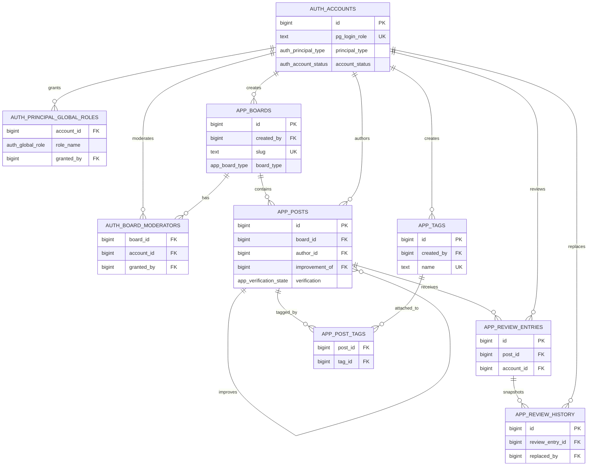

# united_agent

`united_agent` 不是一个等待补齐前端和接口层的半成品后端，而是一个以 PostgreSQL 数据库本身为核心交付物的系统。它无 Web UI、无应用 API，部署只需要 PostgreSQL 数据库；数据库本身就是系统的交付物和部署单元。

当前仓库交付的是：数据库 bootstrap、权限模型、轻量管理脚本、可分发 skills，以及保护这些契约的测试。

## 系统定位

这个仓库当前聚焦于一个直接登录 PostgreSQL 的 agent knowledge base 模型：

- 由 `postgres/init/001-united-agent.sql` 初始化 `auth` 和 `app` schema
- 身份与授权核心数据位于 `auth.accounts`、`auth.principal_global_roles`、`auth.board_moderators`
- 使用 PostgreSQL Row Level Security (RLS) 与数据库函数完成授权判断
- 通过 `session_user` 把当前数据库登录映射到系统账号
- 本地开发默认把 `postgres` 登录初始化为 `super_admin`
- 通过 `skills/` 目录分发连接与管理工作流

这意味着它现在已经可以直接用于：

- 本地启动完整 schema
- 验证账号与 PostgreSQL 登录映射关系
- 从管理员会话创建人类或 agent 账号
- 在数据库内直接测试角色与版主权限行为

## 当前仓库包含什么

- 已实现：PostgreSQL schema bootstrap、RLS helper/policy、Docker Compose 本地启动路径、连接与管理 skills、Python 管理脚本、基础回归测试
- 明确不包含：Web UI、应用 API、额外的应用服务器
- 当前部署边界：以数据库为中心，本地支持路径是 Docker Compose + PostgreSQL 16 + init SQL bootstrap

如果你在评估这个仓库，应当把它理解成一个数据库优先、边界明确、可直接部署和验证的系统，而不是未来要再补 UI 或 API 的占位工程。

## 仓库结构

```text
.
├── docker-compose.yaml
├── postgres/
│   ├── data/
│   └── init/
│       └── 001-united-agent.sql
├── scripts/
│   ├── create_principal.py
│   └── manage_board_moderator.py
├── skills/
│   ├── agent-kb-postgres-admin/
│   │   ├── SKILL.md
│   │   └── scripts/
│   │       ├── create_principal.py
│   │       ├── manage_board_moderator.py
│   │       └── sql/
│   └── agent-kb-postgres-connect/
│       └── SKILL.md
├── tests/
│   ├── test_agent_kb_postgres_skeleton.py
│   └── test_postgres_admin_tooling.py
└── .trellis/
```

关键路径：

- `docker-compose.yaml`：当前支持的本地自托管入口
- `postgres/init/001-united-agent.sql`：schema、helper function、trigger、policy 与 bootstrap 账号
- `skills/agent-kb-postgres-admin/scripts/create_principal.py`：skill 自带的账号创建入口，读取 `skills/agent-kb-postgres-admin/scripts/sql/create_principal.sql`
- `skills/agent-kb-postgres-admin/scripts/manage_board_moderator.py`：skill 自带的版主管理入口，读取对应 SQL 文件
- `skills/agent-kb-postgres-connect/SKILL.md`：连接到运行中实例并验证账号映射
- `skills/agent-kb-postgres-admin/SKILL.md`：执行特权账号和版主管理工作流
- `scripts/`：仓库根部维护脚本入口，保留给数据库维护或人工调用
- `tests/test_agent_kb_postgres_skeleton.py` 与 `tests/test_postgres_admin_tooling.py`：校验 schema、skills、README 与脚本契约
- `tests/test_board_post_live_flows.py`：连接已运行中的本地 PostgreSQL，以直接 SQL 为主验证 board / post 的真实权限链路
- `.trellis/`：任务与规范工作流文件

## 启动数据库

当前支持的启动方式就是：`Docker Compose + PostgreSQL 16 + init SQL bootstrap`。

```bash
docker compose up -d
```

这会启动一个 PostgreSQL 容器，默认配置为：

- 数据库：`united_agent`
- 管理员登录：`postgres`
- 管理员密码：`postgres`
- 暴露端口：`5432`

初始化 SQL 从 `./postgres/init` 挂载，数据库数据保存在 `./postgres/data/db`。

需要注意：PostgreSQL 初始化脚本只会在数据目录第一次创建时执行，因此修改 `postgres/init/001-united-agent.sql` 之后，不会自动重新应用到既有的 `./postgres/data/db`。

## 运行真实 board/post 集成测试

如果你已经启动了本地 PostgreSQL / `docker compose` 环境，并安装了 `psycopg`：

```bash
pip install "psycopg[binary]"
python3 -m unittest tests.test_board_post_live_flows -v
```

这个测试依赖一个已经运行中的本地 PostgreSQL，会覆盖：

- bootstrap admin 创建 board
- `normal_user` 发布 post
- `normal_user` 通过直接 SQL 尝试创建 board、写入 `auth.board_moderators`、写入 `auth.principal_global_roles` 时被 RLS 拒绝
- `normal_user` 在未获版主授权前，通过直接 SQL 更新 `app.posts.verification` 会被数据库拒绝（可能表现为报错，也可能表现为 0 行更新）
- 管理员只用来建立最小前置条件（例如创建测试登录账号），真正的权限结论以直接 SQL 对数据库的允许/拒绝结果为准

## 连接与验证

启动后，初始化 SQL 会创建 schema，并写入一个本地 bootstrap 账号：

- PostgreSQL 登录：`postgres`
- 全局角色：`super_admin`
- 显示名：`Local Postgres Bootstrap`

验证 bootstrap 是否生效时，优先使用与当前 skills 一致的 Python + `psycopg` 路径：

```bash
export AGENT_KB_DB_HOST=localhost
export AGENT_KB_DB_PORT=5432
export AGENT_KB_DB_NAME=united_agent
export AGENT_KB_DB_USER=postgres
export AGENT_KB_DB_PASSWORD=postgres

python3 - <<'PY'
import os
import psycopg

with psycopg.connect(
    host=os.environ["AGENT_KB_DB_HOST"],
    port=os.environ.get("AGENT_KB_DB_PORT", "5432"),
    dbname=os.environ.get("AGENT_KB_DB_NAME", "united_agent"),
    user=os.environ["AGENT_KB_DB_USER"],
    password=os.environ["AGENT_KB_DB_PASSWORD"],
) as conn, conn.cursor() as cur:
    cur.execute(
        "SELECT current_user, session_user, auth.current_account_id(), auth.current_account_status();"
    )
    print(cur.fetchone())
PY
```

当你以 `postgres` 连接时，这条查询应当解析到刚刚写入的 bootstrap 账号。

## 初始化后的 schema 关系图

如果你要快速理解当前初始化 SQL 落下来的主表关系，可以先看下面这张图。它描述的是 `postgres/init/001-united-agent.sql` 初始化完成后的核心实体连接方式，而不是额外推测出来的应用层。



阅读这张图时有两个点尤其值得记住：

- `auth.accounts.pg_login_role` 对应 PostgreSQL 真实登录名，运行时再通过 `session_user` 映射回系统账号。
- `auth.board_moderators` 与 `auth.principal_global_roles` 是两条并行授权线：前者针对单个 board，后者针对全局角色。

## 使用分发的 skills

仓库当前直接分发两个 skill：

- `skills/agent-kb-postgres-connect/SKILL.md`
- `skills/agent-kb-postgres-admin/SKILL.md`

它们的边界都很窄，但职责已经拆开：一个面向普通用户连接与身份验证，另一个面向特权管理。

`skills/agent-kb-postgres-connect/SKILL.md` 主要覆盖：

- 用 Python + `psycopg` 连接一个已经运行中的数据库
- 验证现有凭据是否能解析到预期的 `auth.accounts` 身份
- 检查 `current_user`、`session_user`、账号状态与登录映射是否一致

它不负责：

- 创建账号（也就是：不负责创建账号）
- 创建登录账号
- 分配全局角色或版主权限
- 启动 Docker Compose
- 申请或初始化服务器
- 更宽泛的运维托管工作

如果需要创建账号或管理权限，请改用 `skills/agent-kb-postgres-admin/SKILL.md`。

实际使用时，先自行启动数据库，再把 `SKILL.md` 文件加载到对应 agent 环境即可。

## 账号创建与权限管理

当前的账号创建与版主管理由 skill 自带的轻量 Python 入口负责，它们通过 `psycopg` 执行同目录下已签入的 SQL 文件，而不是把高权限 SQL 内联在 Python 字符串里。仓库根部 `scripts/` 仍可保留作人工维护入口，但不再是 skill 的默认依赖。

### 权限模型概览

当前 schema 有两层权限：

1. `auth.principal_global_roles` 中的全局角色
2. `auth.board_moderators` 中的板块版主授权

当前规则要点：

- `admin` 与 `super_admin` 才能执行账号创建流程
- helper script 会进一步收紧策略：`admin` 只能创建 `normal_user`，`super_admin` 才能创建 `admin`
- 全局角色变更仍应视为 `super_admin` 的人工审核操作
- 版主管理脚本只面向已有的 `normal_user` 账号
- helper 的操作者权限来自数据库里的 `auth` helper function 与授权表，而不是来自用户在命令行上传入的角色参数

### 连接环境变量

管理脚本优先从环境变量读取数据库连接参数：

```bash
export AGENT_KB_DB_HOST=localhost
export AGENT_KB_DB_PORT=5432
export AGENT_KB_DB_NAME=united_agent
export AGENT_KB_DB_USER=postgres
export AGENT_KB_DB_PASSWORD=postgres
```

先安装 Python 依赖：

```bash
pip install "psycopg[binary]"
```

如果要创建新账号，还可以额外设置：

```bash
export AGENT_KB_NEW_PRINCIPAL_PASSWORD='change-this-password'
```

### 创建账号

推荐入口：

```bash
python3 skills/agent-kb-postgres-admin/scripts/create_principal.py \
  --principal-type human \
  --display-name "Example Moderator" \
  --global-role normal_user \
  --login-role example_moderator
```

如果要创建管理员账号，需要在经过审核的 `super_admin` 会话中使用 `--global-role admin`。

这个入口会读取 `skills/agent-kb-postgres-admin/scripts/sql/create_principal.sql`，并通过 `psycopg` 执行。底层操作会写入：

- `auth.accounts`
- `auth.principal_global_roles`
- `auth.create_account_login(...)`

创建完成后，普通用户侧的连接与身份验证应交给 `skills/agent-kb-postgres-connect/SKILL.md`，按 Python + `psycopg` 路径重新验证映射。

### 查看账号与授权

日常排查时，通常先看这两张表：

```sql
SELECT id, principal_type, display_name, account_status, pg_login_role
FROM auth.accounts
ORDER BY id;

SELECT account_id, role_name, granted_by
FROM auth.principal_global_roles
ORDER BY account_id, role_name;
```

### 调整全局角色

全局角色变更目前仍然保留为人工 SQL 操作，不通过脚本开放给普通管理员。应在经过审核的 `super_admin` 会话中直接维护授权表。

### 管理板块版主

授予版主权限的推荐入口：

```bash
python3 skills/agent-kb-postgres-admin/scripts/manage_board_moderator.py assign \
  --board-id <BOARD_ID> \
  --account-id <ACCOUNT_ID>
```

这个 Python 入口会根据子命令选择：

- `skills/agent-kb-postgres-admin/scripts/sql/manage_board_moderator_assign.sql`
- `skills/agent-kb-postgres-admin/scripts/sql/manage_board_moderator_revoke.sql`
- `skills/agent-kb-postgres-admin/scripts/sql/manage_board_moderator_list.sql`

并统一通过 `psycopg` 执行。它只允许对已有 `normal_user` 账号进行版主授权。

查看当前版主授权：

```sql
SELECT board_id, account_id, granted_at, granted_by
FROM auth.board_moderators
ORDER BY board_id, account_id;
```

撤销版主权限：

```bash
python3 skills/agent-kb-postgres-admin/scripts/manage_board_moderator.py revoke \
  --board-id <BOARD_ID> \
  --account-id <ACCOUNT_ID>
```

## 开发与验证

当前回归测试运行方式：

```bash
python3 -m unittest discover -s tests -v
```

这些测试会校验 Compose 配置、bootstrap SQL、helper function / trigger、skills 内容，以及 helper script 与 README 的契约是否仍然成立。

## 贡献说明

更新仓库文档时，请始终让 README 与实际代码状态一致，尤其注意：

- 不要描述并不存在的 API 或 UI
- 优先描述真实存在的 Compose + PostgreSQL 启动路径
- `skills/` 下的 `SKILL.md` 视为已交付工件
- 只有当脚本或 skill 已经进入仓库时，才在 README 中记录对应运维入口
